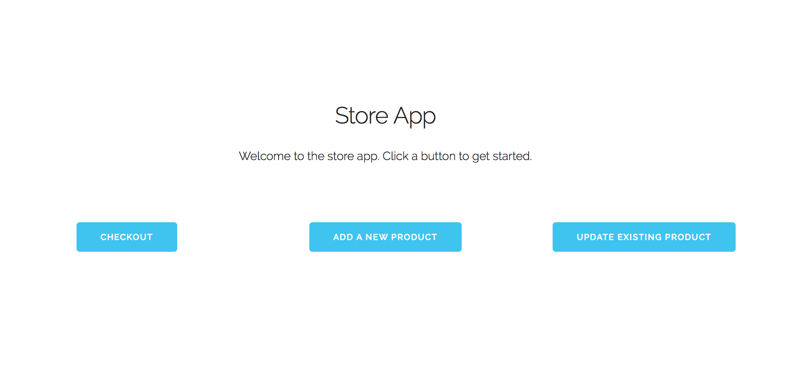

#Use Case 1: Add an item to the database

For example, assume we want to add a product "water bottles" to the database

First, we open the store app 

Next, we click on the "ADD A NEW PRODUCT" button. We fill out the product 
information for this item, and click submit when finished

Finally, we see that our item has been added to the database 

