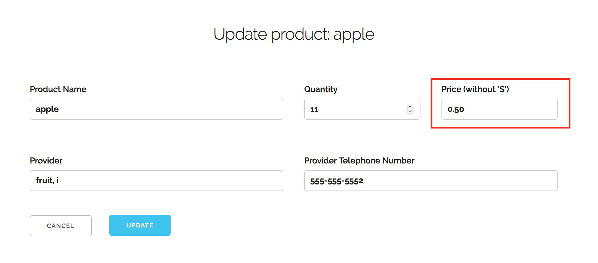
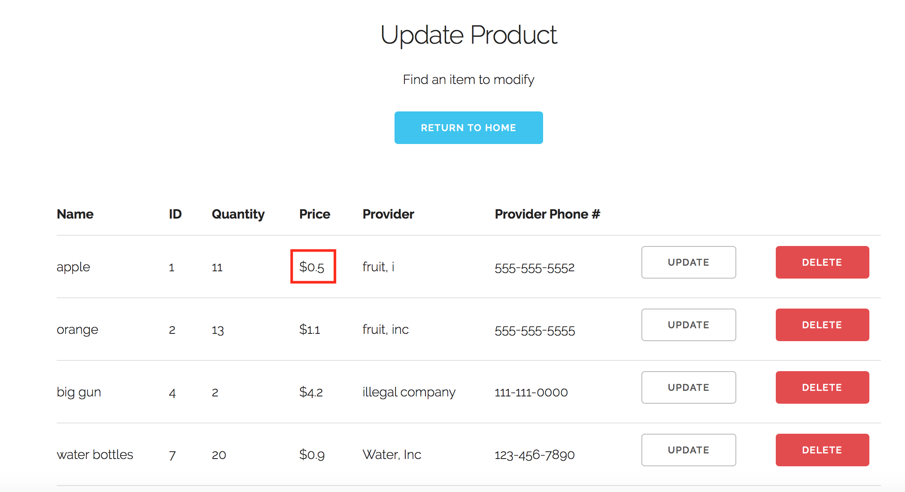

#Use Case 2: Update a product

For example, assume we want to change the price of apples from $1.00 to $0.50

First, we open the store app 

Next, we click on the "UPDATE EXISTING PRODUCT" button. We are taken to a page 
displaying existing items. we find the item we want to update, and select the 
"Update" button 

Next, we are taken to a page with the existing information for the product 
already filled in

Now we will change the price for apples from $1.00 to $0.50 and click "submit" 
at the bottom of the page

Finally, we are taken to an updated version of the database where the changed 
information is visible 

