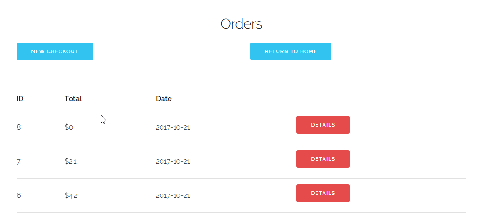
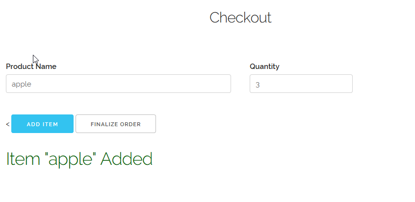

#Use Case 3: Checkout

First, we open the store app.

Next, we click the "Checkout" button on the very left. This brings us to the
orders page.

Listed here are all of the different orders. (If you wanted to view their
receipts, you could click the "Details" button next to the one you want to see.)

To start the checkout process, we click "New Checkout". This brings us to the
add item screen.

Input the item information you want to add and click the "Add Item" button.
If the item exists, a message will appear on the bottom that says "Item \<name\>
Added".

If the item doesn't exist, a message will appear in the same place that says
"Item \<name\> Not Found".

Repeat this process for as many items as you want to add to the checkout. Once
all the items have been added to the order, click the "Finalize Order" button.
This brings us to the receipt page of the order we completed.

From here, we can go back to the orders page, or go back to the home page. That
concludes the **Checkout** use case.
