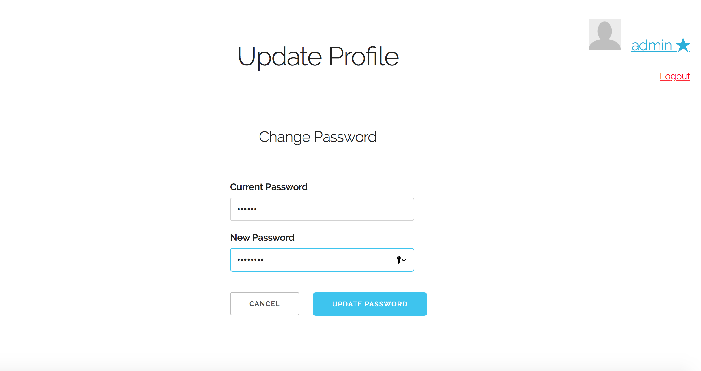

# Use Case 1: Change log in password

Assume we are already logged in to our 'admin' account.

First, we click on our blue username at the top right of the home screen

Now we must type our old password, along with our desired new one

Assuming we typed our old password correctly, and neither field was blank, we see that we have a message that informs us that our action was successful.

