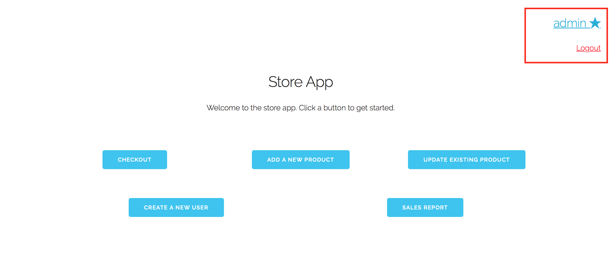
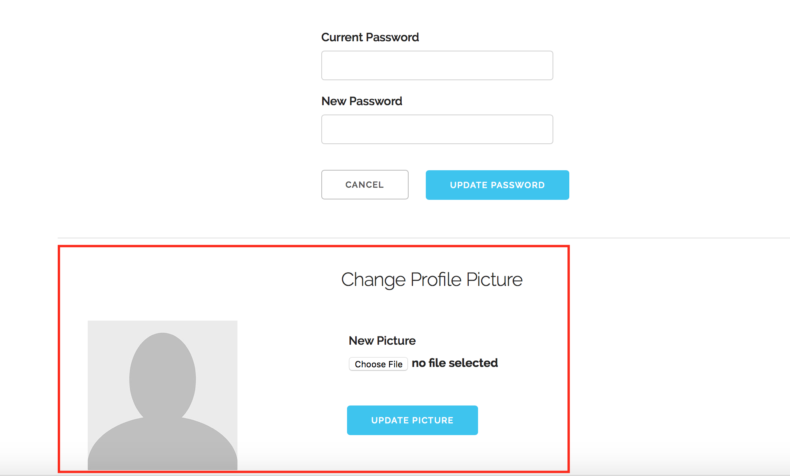
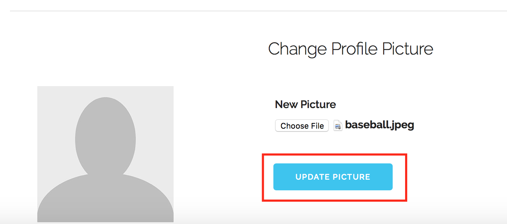

# Use Case 3: Change profile picture

Assume we are already logged in to the 'admin' account, which is a manager.

First, we click on our blue username at the top right of the home screen

Now we scroll down on the page until we see "Change Profile Picture"

Now we click on "choose file" to select a new image, and a selection window opens.

We select the desired image, and click "Update Picture"

Now we can see that our action was successful, and we have a new profile picture

