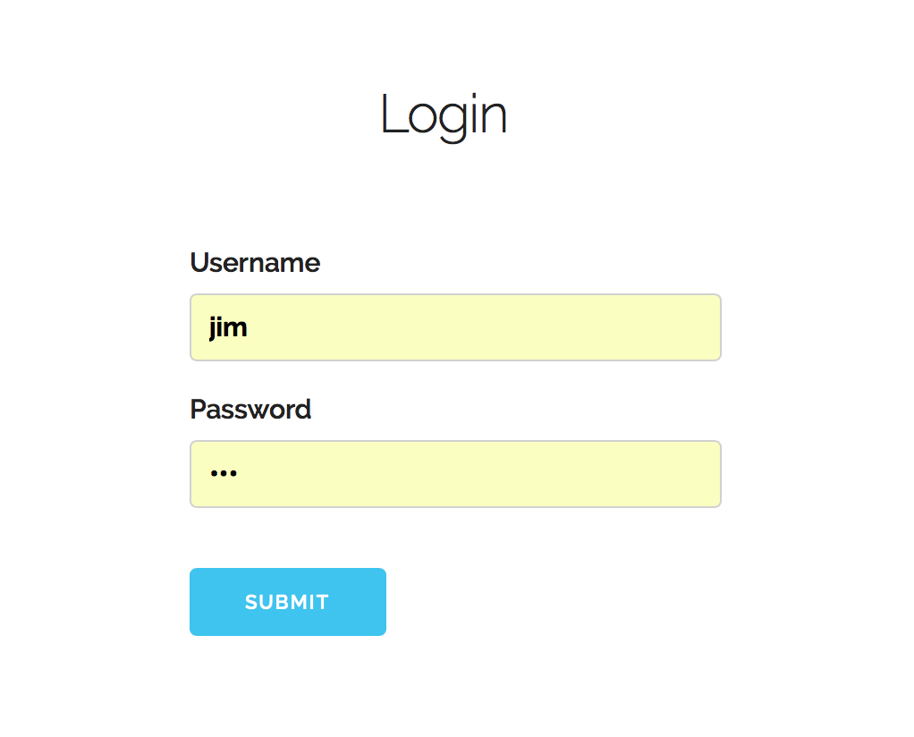
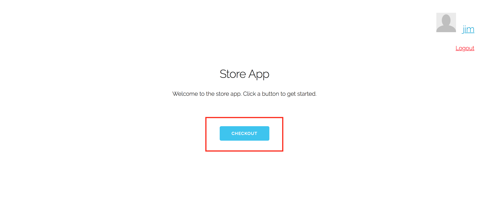
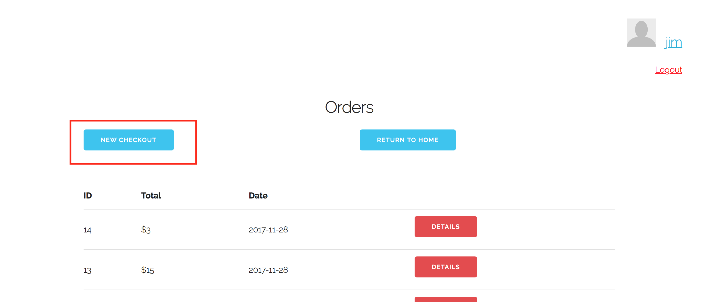
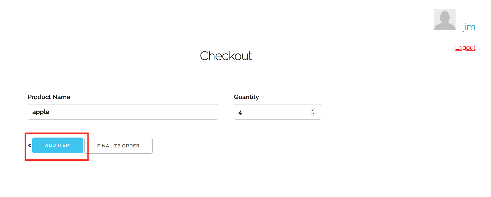
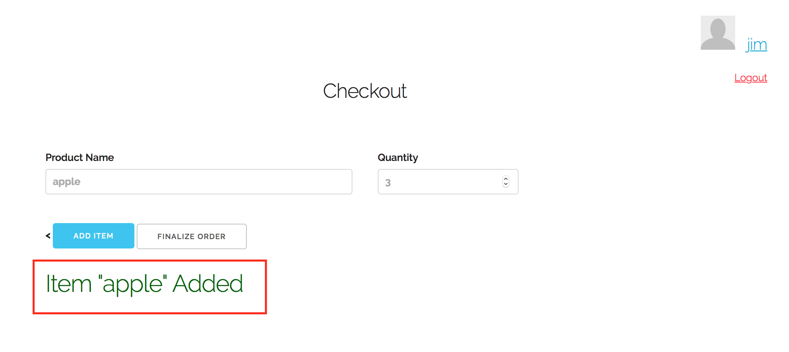
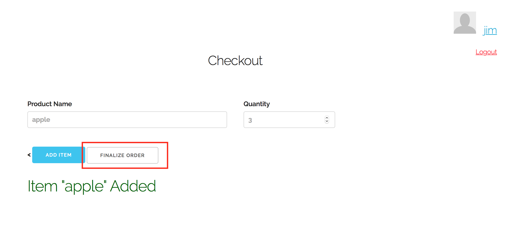
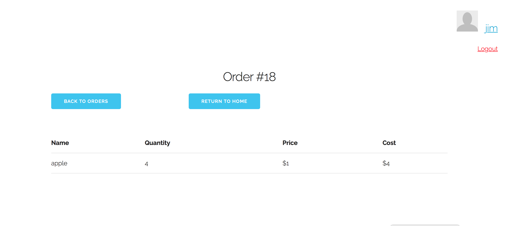

# Use Case 4: Checkout order as cashier

First, we visit the store app

Now we will log into an account named "jim", who is classified as a cashier

Now from the home page, we click on "checkout"

Now from this page that displays a list of previous transactions, we click on "New Checkout"

Now we have the option to add items to our order. We type the name of each item, and the quantity to be purchased. Here we will simply buy 4 apples.

Once we click "Add Item", we can see that there is a confirmation message, and the input boxes are cleared

Once all the items have been added, we click on the "Finalize Order" button

Now we see the final status of our order (the receipt), and we can go back to the homescreen once we are done viewing the receipt.

