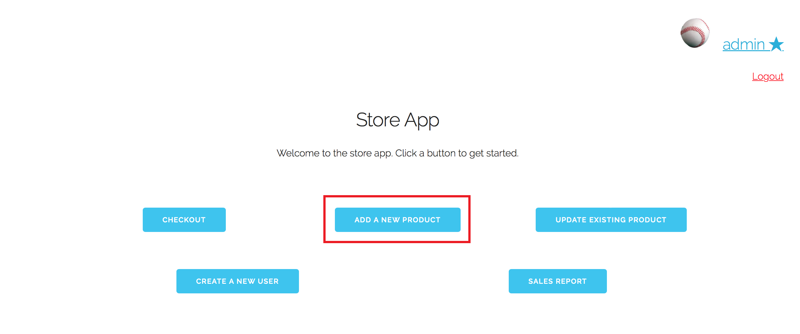
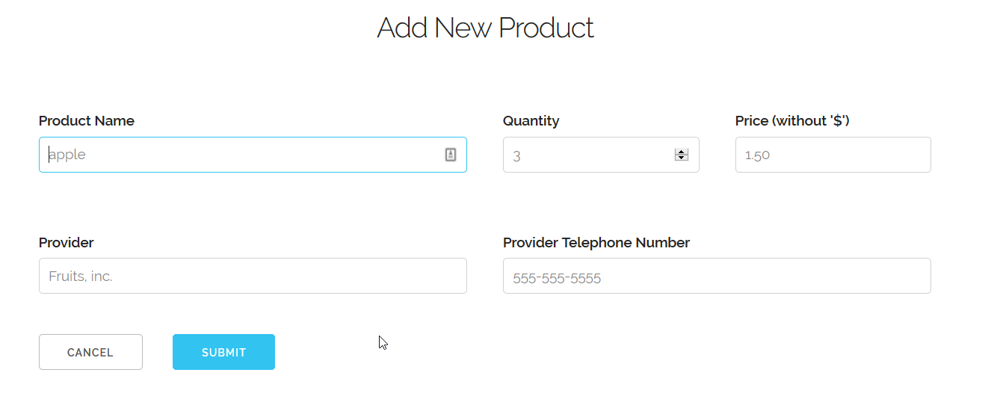
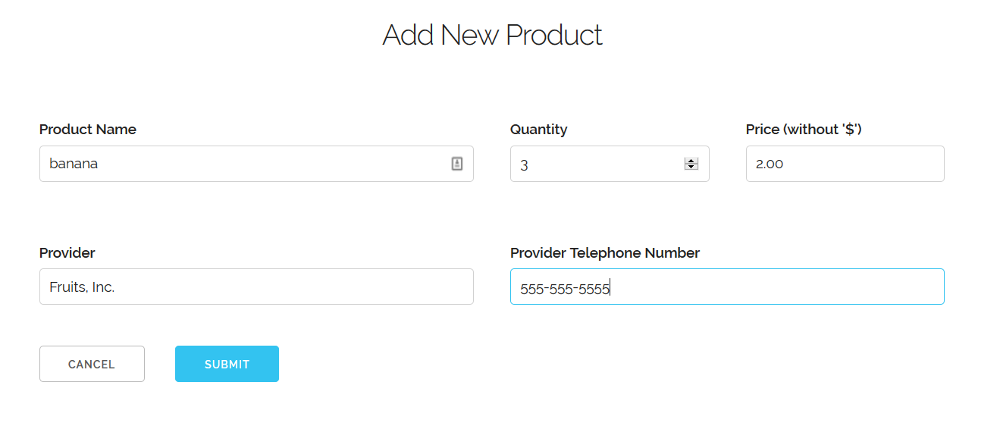
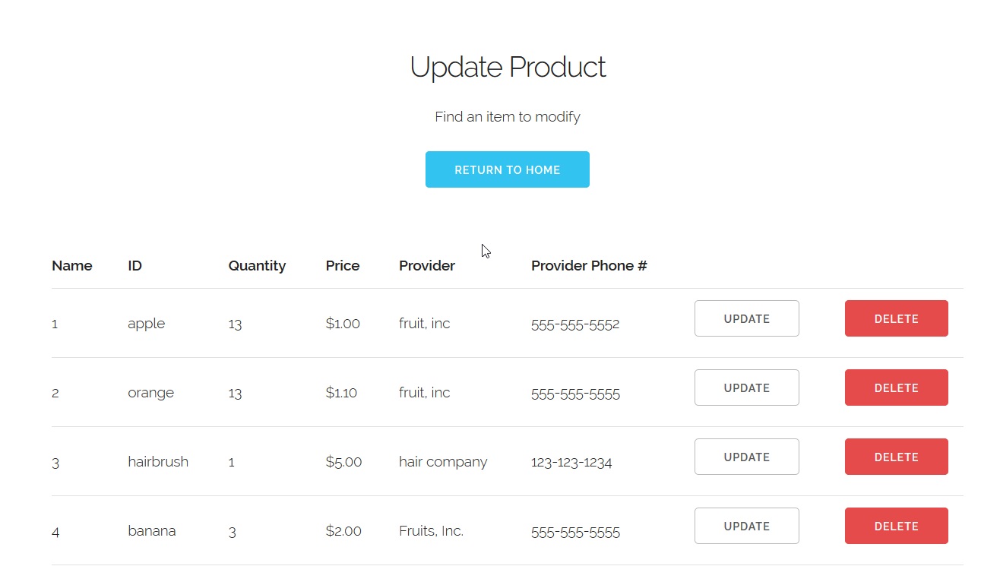

# Use Case 5: Add a Product to the Inventory

Assume that we are already logged into the "admin" account, which is classified 
as a manager. From the home screen, we click on "Add New Product"

This brings us to the New Item form. Some sample values are shown in grey.

Let's say we want to add 3 bananas at $2.00/piece to our inventory. We enter
the appropriate information in the dialog boxes.

Now we click "Submit"

Now we are taken back to the inventory page, where we can see that bananas have
been added to the available inventory.

