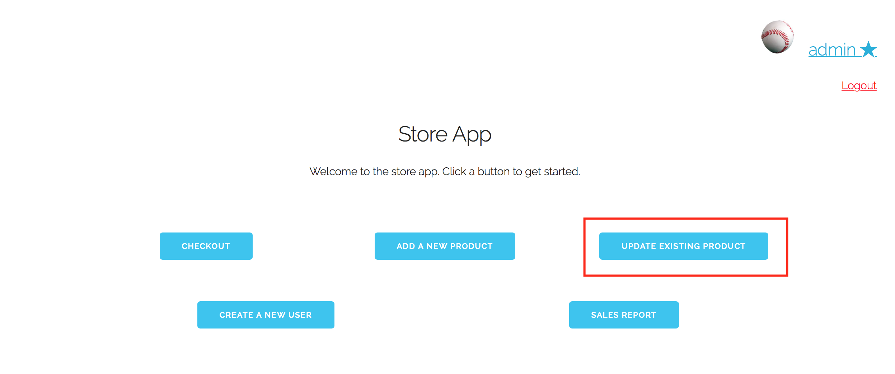
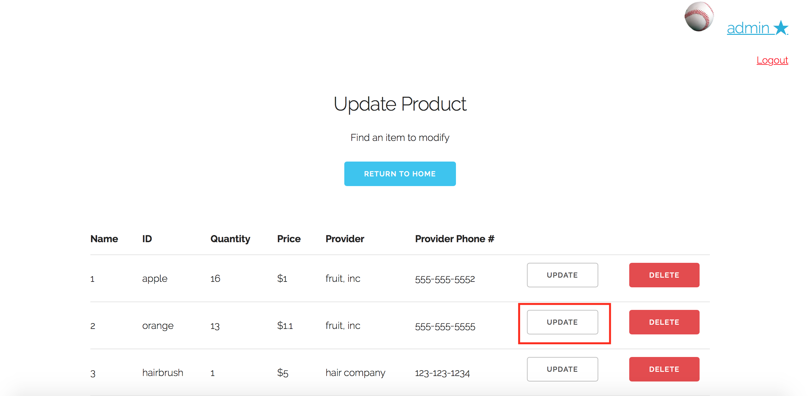
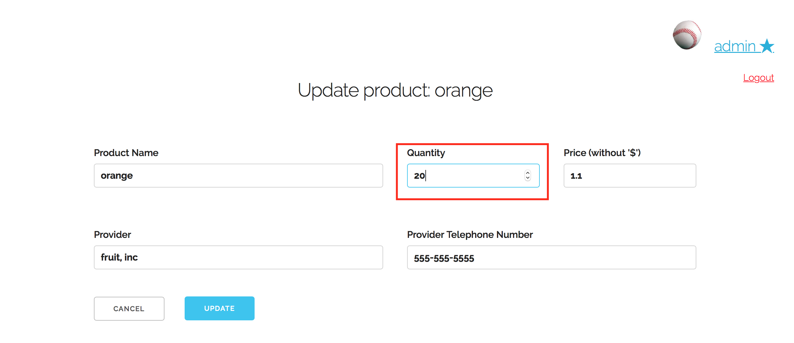
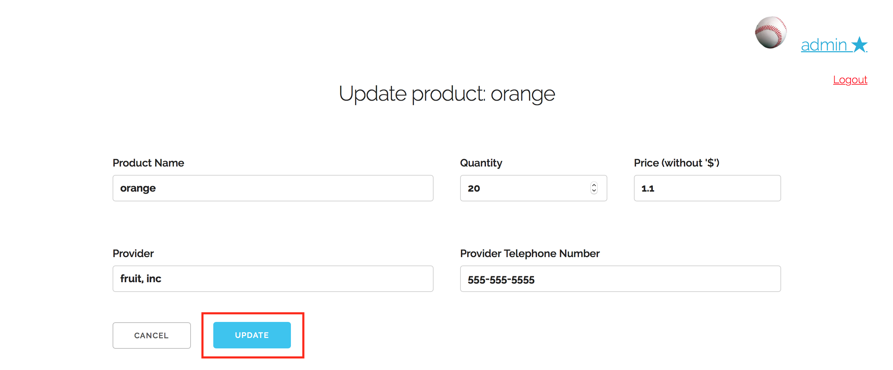
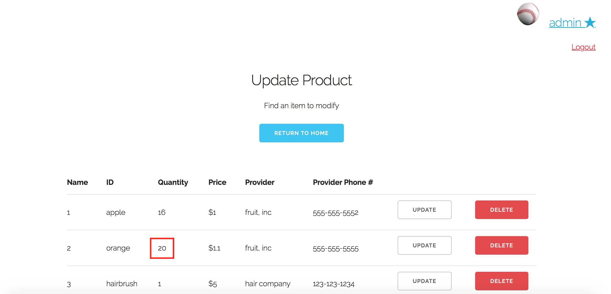

# Use Case 6: Update A product in inventory

Assume that we are already logged into the "admin" account, which is classified as a manager.
From the home screen, we click on "Update Product"

Let's say we want to update the number of oranges in our inventory from 13 to 20. We simply click on the "Update" button on the row of the oranges

Now in the update item page, we increase the quantity in the editable quantity box

Now we click "Update"

Now we are taken back to the inventory page, where we can see that the quantity of oranges has been updated

