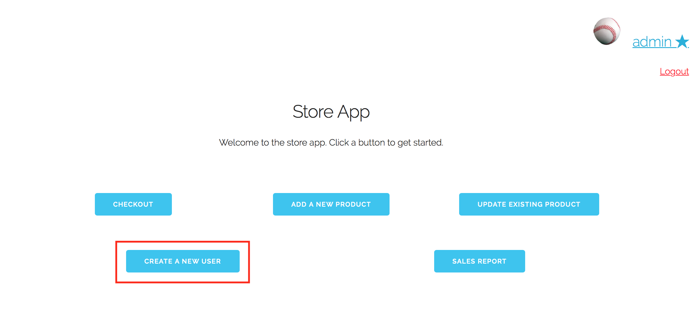
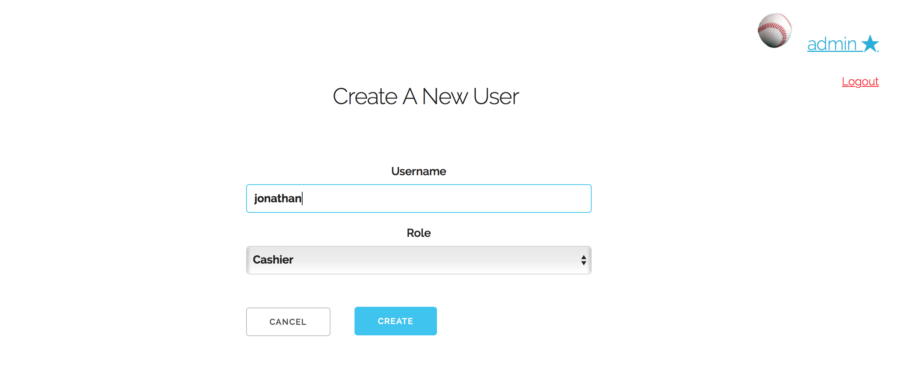
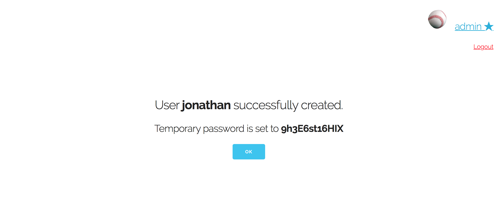

# Use Case 7: Create a New user

Assume that we are already logged into the "admin" account, which is classified as a manager.
From the home screen, we click on "Create a new user"

Now we are taken to a page where we can decide the username and role of this new user. Let's add a new user named Jonathan, who is a cashier. So we simply type "jonathan" in the username space, and select "cashier" from the dropdown list

Now we click "create", and we are taken to a confirmation page that shows us the default generated password for jonathan.

Once we have written down the temporary password, we click "ok"