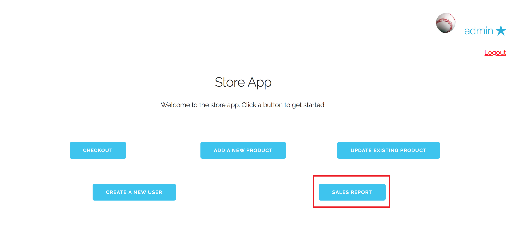
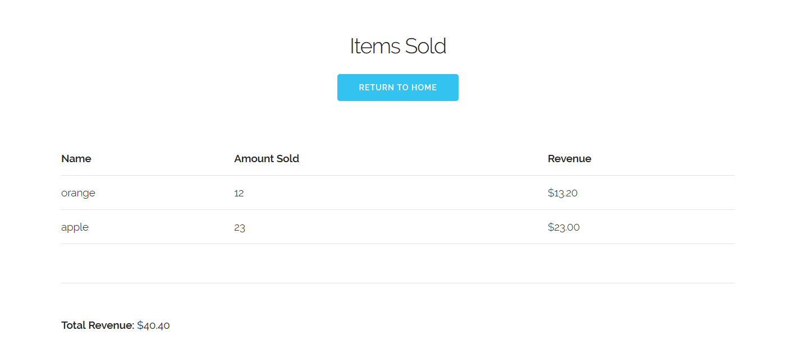

# Use Case 8: View Sales Report

Assume that we are already logged into the "admin" account, which is classified 
as a manager. From the home screen, we click on "Sales Report"

Now we are taken to the Sales Report page. All items sold are listed with their
quantities and revenue. The bottom of the page displays the total revenue from
all sales.

