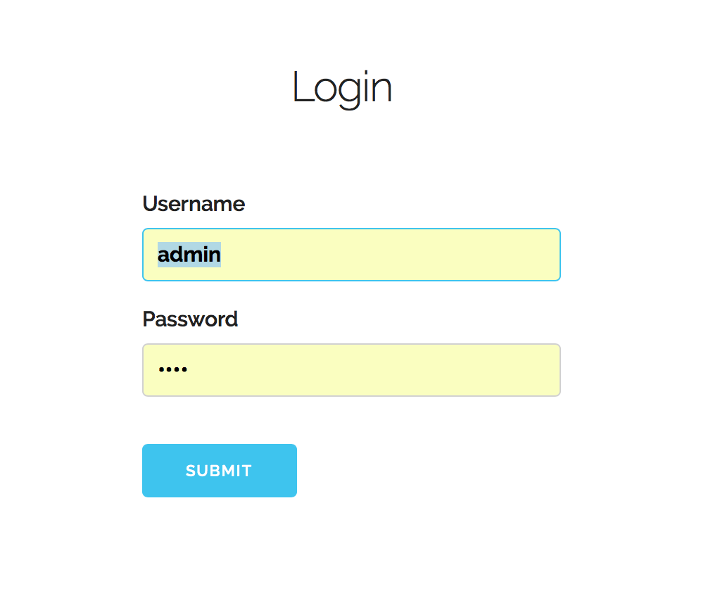

# Use Case 1: Log in

Assume we are logging into the 'admin' account, which is classified as a manager.

First, we visit the store app

We are prompted to log in, so we type our credentials and click 'submit'

Finally, we see that we are now logged in

